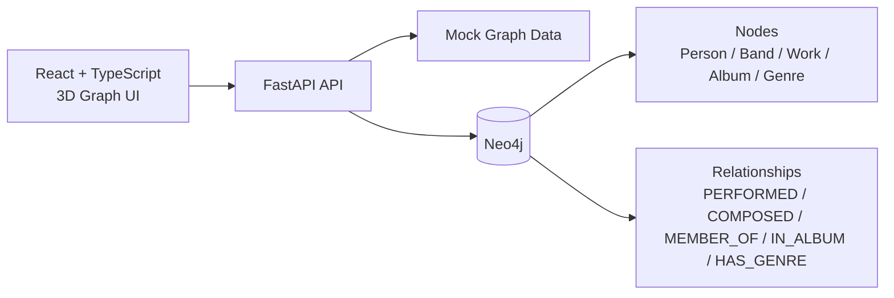

<div align="center">

# MusicGraph

### 面向实体关系探索的 3D 知识图谱浏览器

一个以 `Neo4j + FastAPI + React + TypeScript` 为核心的通用知识图谱原型，
支持两种模式：**音乐关系探索** 和 **三国演义关系探索**。

<p>
  
  
  
  
  
</p>

</div>

---

## 项目简介

`MusicGraph` 不是通用后台系统，也不是完整的 GraphRAG 平台。
它支持两种模式：

### 模式 1: 音乐知识图谱
- 搜索人物、乐团、作品、专辑、流派
- 在 3D 空间中展开实体邻居关系

### 模式 2: 三国演义知识图谱 ⭐ NEW
- 使用 spaCy 中文模型从三国演义文本中自动提取实体和关系
- 内置 60+ 核心人物别名映射表，支持实体消歧（"玄德" → "刘备"）
- 基于共现分析自动构建人物关系网络
- 搜索人物、地点、事件、官职
- 浏览三国人物之间的关系网络

第一阶段暂不包含：

- GraphRAG
- 向量检索
- 自动抽取流水线
- 复杂权限系统
- MySQL 双库治理

## 快速导航

- [当前状态](#当前状态)
- [功能一览](#功能一览)
- [架构预览](#架构预览)
- [技术栈](#技术栈)
- [快速开始](#快速开始)
- [目录结构](#目录结构)
- [API 一览](#api-一览)
- [示例实体](#示例实体)
- [项目文档](#项目文档)
- [下一步路线](#下一步路线)

## 当前状态

当前仓库已经完成这些基础能力：

- `FastAPI` 后端接口骨架
- `Neo4j` 适配层与全文搜索优先策略
- `mock` 图数据模式
- `Neo4j schema / seed / reset` 脚本
- `Neo4j` 一键初始化脚本
- `docker-compose.yml`
- `React + TypeScript + Vite` 前端骨架
- `react-force-graph-3d` 3D 图谱页面
- 第一轮前端视觉和交互优化

一句话概括当前阶段：

> 项目已经不是空仓库，而是一个可以继续向真实图数据库联调推进的 3D 音乐图谱原型。

## 功能一览

| 模块 | 当前能力 |
| --- | --- |
| 搜索 | 支持按关键词搜索实体，支持按类型过滤 |
| 图谱 | 支持 1 跳展开、路径高亮、节点点击聚焦 |
| 详情 | 支持实体详情与扩展属性展示 |
| 数据源 | 支持 `mock` 模式与 `Neo4j` 模式 |
| 初始化 | 支持 Docker 启动 Neo4j，支持一键导入 schema 与样例数据 |

## 架构预览



## 技术栈

| 层级 | 方案 |
| --- | --- |
| 前端 | `React` + `TypeScript` + `Vite` |
| 3D 可视化 | `react-force-graph-3d` |
| 后端 | `Python` + `FastAPI` |
| 图数据库 | `Neo4j 5` |
| 本地部署 | `Docker Compose` |

## 快速开始

### 1. 启动 Neo4j

在项目根目录执行：

```powershell
docker compose up -d
```

默认地址：

- Neo4j Browser: `http://localhost:7474`
- Bolt: `bolt://localhost:7687`

默认账号：

- 用户名：`neo4j`
- 密码：`musicgraph123`

### 2. 初始化数据库

在 `backend` 目录执行：

```powershell
Copy-Item .env.example .env
python scripts\init_neo4j.py --reset
```

如果只想单独执行某一步：

```powershell
python scripts\init_neo4j.py --schema-only
python scripts\init_neo4j.py --seed-only
```

### 3. 启动后端

```powershell
cd backend
python -m venv .venv
.venv\Scripts\Activate.ps1
pip install -r requirements.txt
Copy-Item .env.example .env
uvicorn app.main:app --reload
```

默认地址：

- API: `http://localhost:8000`
- Swagger: `http://localhost:8000/docs`

如果切换到真实 Neo4j：

1. 修改 `backend/.env`
2. 将 `MUSICGRAPH_USE_MOCK_DATA=false`
3. 填好 `MUSICGRAPH_NEO4J_URI`、`MUSICGRAPH_NEO4J_USERNAME`、`MUSICGRAPH_NEO4J_PASSWORD`

### 4. 启动前端

```powershell
cd frontend
Copy-Item .env.example .env
npm install
npm run dev
```

默认地址：

- Web: `http://localhost:5173`

默认前端 API 地址：

- `http://localhost:8000/api`

---

<details>
<summary><strong>可选：前端自定义 API 地址</strong></summary>

在启动前端前设置：

```powershell
$env:VITE_API_BASE_URL="http://localhost:8000/api"
```

</details>

## 目录结构

```text
MusicGraph/
  backend/
    app/
      api/
      core/
      data/
      db/
      schemas/
      services/
      main.py
    neo4j/
      schema.cypher
      seed.cypher
      reset.cypher
      romance_schema.cypher    # 三国演义 schema (自动生成)
      romance_seed.cypher      # 三国演义种子数据 (自动生成)
    scripts/
      init_neo4j.py
    requirements.txt
    .env.example
  data/
    README.md
    romance_entities.json      # 三国演义实体别名映射表
    三国演义.txt                # 源文件 (不提交到 git)
    entities.json              # 提取的实体 (自动生成)
    relationships.json         # 提取的关系 (自动生成)
  scripts/
    build_romance_graph.py     # 三国演义图谱构建脚本
  frontend/
    src/
      api/
      components/
      types/
      App.tsx
      main.tsx
      styles.css
    package.json
    .env.example
  docs/
    architecture.md
    database.md
    frontend-backend.md
    romance-mode.md            # 三国演义模式文档
  docker-compose.yml
  README.md
```

## API 一览

- `GET /api/health`
- `GET /api/search?q=`
- `GET /api/entities/{id}`
- `GET /api/graph/{id}?depth=1`
- `GET /api/path?from=&to=`

## 示例实体

可以先用这些样例实体测试：

- `person_jay_chou`
- `person_fang_wenshan`
- `work_qinghuaci`
- `band_mayday`
- `person_ashin`

## 项目文档

- [架构方案](docs/architecture.md)
- [数据库设计与 Neo4j 设置](docs/database.md)
- [前后端方案](docs/frontend-backend.md)

## 下一步路线

- [x] 搭建后端 API 骨架
- [x] 搭建前端 3D 图谱页面
- [x] 接入 `mock` 数据模式
- [x] 补齐 `Neo4j` 初始化脚本
- [x] 优化第一轮前端视觉和交互
- [x] 支持三国演义知识图谱模式
- [ ] 完成真实 `Neo4j` 端到端联调
- [ ] 增加节点常驻标签
- [ ] 增加关系类型筛选
- [ ] 增加更细的图谱布局控制
- [ ] 准备真实音乐数据导入方案
- [ ] 完善三国演义实体关系标注

## 说明

这个仓库当前最适合用来做两件事：

1. 快速验证音乐实体关系图在 `Neo4j + 3D UI` 下的展示方式
2. 作为后续 GraphRAG 或更完整音乐知识图谱平台的前置原型
3. **使用 spaCy 从三国演义文本中自动提取知识图谱并可视化浏览**

---

## 参考

这版 README 的组织方式主要参考了 GitHub 官方的 README/Markdown 写法建议，以及一些成熟开源项目在首页上的信息布局方式，例如：

- GitHub Docs: <https://docs.github.com/en/repositories/creating-and-managing-repositories/best-practices-for-repositories>
- GitHub Docs: <https://docs.github.com/en/get-started/writing-on-github/getting-started-with-writing-and-formatting-on-github/quickstart-for-writing-on-github>
- GitHub Docs: <https://docs.github.com/en/get-started/writing-on-github/working-with-advanced-formatting/creating-diagrams>
- GitHub Docs: <https://docs.github.com/github/writing-on-github/working-with-advanced-formatting/organizing-information-with-collapsed-sections>
- GitHub Docs: <https://docs.github.com/en/get-started/writing-on-github/working-with-advanced-formatting/organizing-information-with-tables>
- Vite README: <https://github.com/vitejs/vite>
- FastAPI README: <https://github.com/fastapi/fastapi>
